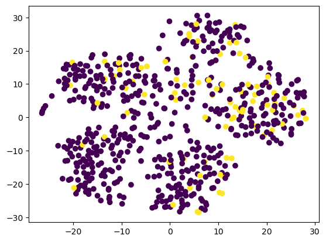
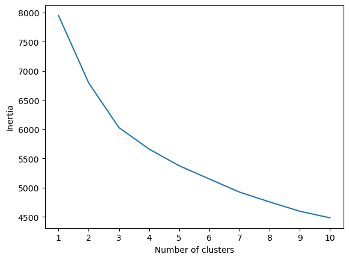
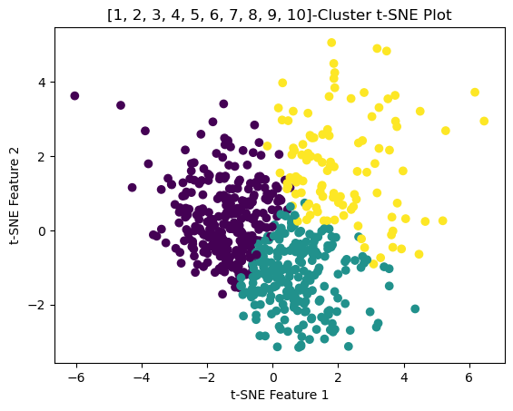

# unsupervised-machine-learning-challenge

In this challenge, several clustering algorithms were used to explore whether patients can be placed into distinct groups, to explore better ways to predict myopia, or nearsightedness. The major steps and their conclusions are listed below.
## Part 1: Data preparation
- Data from a CSV file was loaded into a data frame, and the response variable (whether a patient has myopia) was dropped.
- Data was scaled, to prevent the different scales from distorting the analysis.
## Part 2: Dimensionality reduction using Principal Component Analysis and t-distributed stochastic neighbor embedding (t-SNE)
- Dimensions were reduced using PCA. The number of features were reduced from 14 in the original dataset to 10
- Features were further reduced to 2 using t-SNE
- The t-SNE output was presented in a scatterplot for analysis (Figure 1 below).
 

Figure 1. Scatter plot of t-SNE reduced data.
 
## Part 3: Cluster Analysis with K-means algorithm
- Multiple k-means clustering runs were done, using k=1 to 10, and the resulting "intertia" was ploted in an "elbow plot" (Figure 2). There appears to be an inflexion (elbow) at 3 clusters.
 

Figure 2. Elbow plot.
 
- To provide further input to the analysis, the “KneeLocator” algorithm from the Python package “kneed” was used to identify the knee/elbow point of a line fit to the data. This resulted in k=3.
- Lastly, a 3-cluster solution was plotted (Figure 3), and this seems to confirm k=3 as the best solution.
 

Figure 3. Scatterplot of 3-cluster solution.
 
## Part 4: Recommendation
Based on the analysis detailed above, it appears that a viable clustering strategy is to group patients in three groups.  This is supported by the elbow plot, the KneeLocator algorithm's output, and the scatter plot of a 3-cluster solution, where not much overlap is observed.